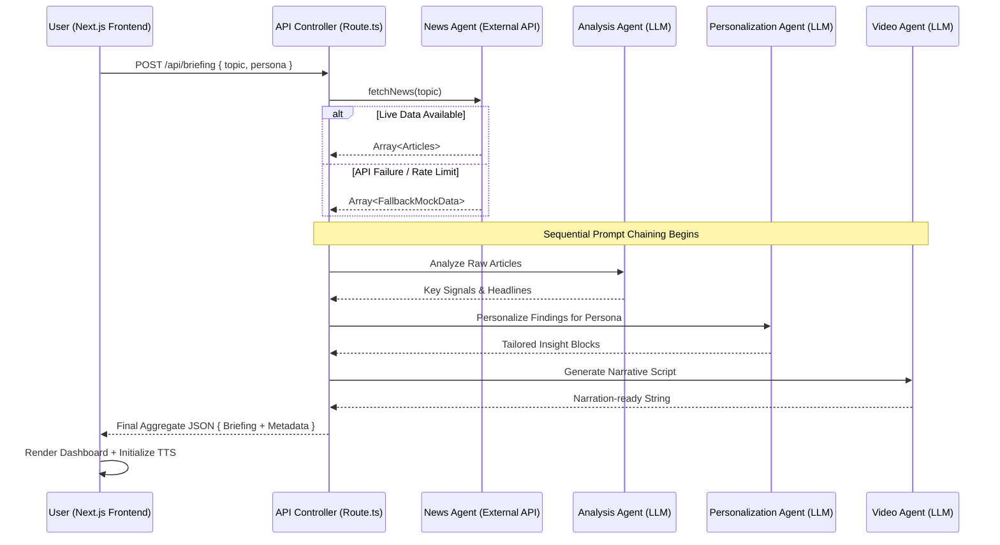

# 🏭 High-Fidelity Multi-Agent System Architecture

## 1. Executive Summary
The **AI News Intelligence Dashboard** is an end-to-end autonomous system designed to solve the "information overload" problem in financial markets. Unlike traditional chatbots that require a conversational loop, this system follows a **Structured Agency Model**. It utilizes a directed acyclic graph (DAG) of specialized LLM processors that collaborate to transform unstructured news data into strategic intelligence.

---

## 2. Integrated System Architecture

---

## 3. Deep-Dive: Agent Specialization & Prompt Engineering

### 🧠 Stage 1: The News Agent (The Harvester)
The News Agent handles the **Input Sanitization & Data Retrieval** phase.
*   **Source**: Integrates with [NewsAPI.org](https://newsapi.org/) Everything endpoint.
*   **Logic**: Uses a 1-hour `revalidate` cache in Next.js to optimize performance and minimize API costs.
*   **Resilience**: Implements a "Soft Failure" pattern. If the API returns a `429` (Rate limit) or `500`, it switches to a local `mock-data.ts` module that provides curated, high-quality historical context tailored to the user's topic.

### 📊 Stage 2: The Analysis Agent (The Strategist)
This agent performs **Semantic Distillation**. Its goal is to separate the "signal" from the "noise."
*   **Prompt Strategy**: Zero-shot Chain of Thought (CoT). It is instructed to look for **causality**—why an event happened—rather than just the event itself.
*   **Thinking Pattern**:
    1.  Compare multiple articles for consistency.
    2.  Identify outliers or unique data points.
    3.  Distill 5 key highlight points that summarize the "market mood."

### 🎯 Stage 3: The Personalization Agent (The Interpreter)
The most critical agent for User Experience (UX). It acts as a **Dynamic Content Filter**.
*   **Conditional Logic**: Injected into the system prompt based on `userType`.
*   **Target Personas**:
    *   **Beginners**: Focuses on accessibility. It avoids complex financial jargon (e.g., instead of "Yield Curve Inversion," it explains "Long-term vs Short-term borrowing rates").
    *   **Investors**: Focuses on alpha. It looks for technical indicators, pricing signals, and macroeconomic correlations.

### 🎥 Stage 4: The Video Agent (The Narrator)
Generates the final human-centric interface.
*   **Task**: "Narration Scripting."
*   **Constraint**: Must be exactly 4-6 lines of text, using prosody-friendly language (easy for Text-to-Speech engines to pronounce naturally).
*   **Integration**: Feeds directly into the Web Speech API on the frontend.

---

## 4. Technical Stack & Implementation Details

| Layer | Technology | Rationale |
|---|---|---|
| **Frontend** | Next.js 15 (App Router) | Server-side rendering for SEO and zero-client-bundle API routes. |
| **Styling** | Tailwind CSS + Shadcn/ui | Accelerated design system development with premium aesthetics. |
| **Inference** | [Groq](https://groq.com/) | Near-instant model response times (<500ms) for high-latency tasks. |
| **Language Model** | Llama 3.3 (70B) | State-of-the-art reasoning for complex analysis and multi-agent simulation. |
| **AI Orchestration** | [Vercel AI SDK](https://sdk.vercel.ai/) | Standardized interface for AI interactions across different providers. |

---

## 5. Security & Error Handling

### API Resilience
The system uses a **Circuit Breaker**-inspired pattern for its API routes:
1.  **Validation**: All incoming requests are validated via **Zod** schema (Topic length, User Persona integrity).
2.  **Strict JSON Enforcement**: The LLM prompt is engineered to return **raw JSON strings** only. We utilize `ai/JSON.parse` but wrap it in a `try-catch` to handle potential hallucinated characters.
3.  **Fallback Delivery**: If the entire LLM pipeline fails, the system returns a `500` status with a developer-friendly error message, which is caught by the frontend `toast` system.

### Privacy & Data Safety
*   **Zero-Persistence**: User searches are only stored in the local `localStorage` of the browser, ensuring user privacy by design.
*   **Environment Isolation**: Sensitive keys (`GROQ_API_KEY`, `NEWS_API_KEY`) are kept on the server and never exposed to the client-side bundle.

---

## 6. Future Roadmap
*   **Multi-Modal Agents**: Integrating image generation for news-related visuals.
*   **Vector Search (RAG)**: Using memory buffers to allow agents to "remember" previous news cycles across different sessions.
*   **Multi-Source News**: Expanding beyond NewsAPI to GDELT or custom web scrapers for deeper coverage.

---
*Created for High-Performance AI Hackathon Submission—focusing on Autonomous Systems and Agent Orchestration.*
