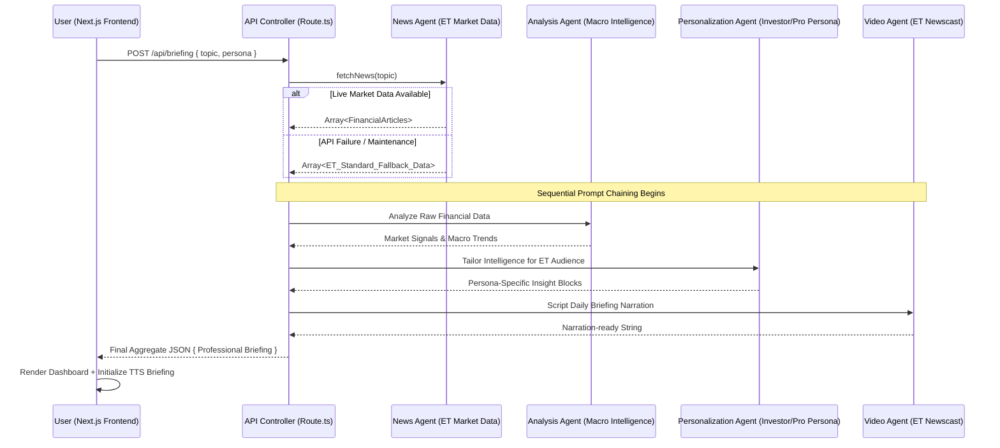

# 🏛️ The Economic Times: High-Fidelity Multi-Agent Intelligence Architecture

## 1. Executive Summary: The Next-Gen Financial newsroom
The **Economic Times (ET) AI News Intelligence Dashboard** is a state-of-the-art autonomous system designed to augment financial journalism and investor intelligence. This pilot project demonstrates how a **Structured Agency Model** can solve the "information avalanche" faced by ET's global audience. 

By leveraging a directed acyclic graph (DAG) of specialized AI agents, the platform transforms high-velocity market data from multiple global sources into the precise, high-utility intelligence expected by a top-tier business daily.

---

## 2. Integrated System Architecture

---

## 3. Deep-Dive: Financial Agent Specialization

### 🧠 Stage 1: The News Harvester (ET Market Interface)
The Harvester is designed to handle **High-Velocity Financial Data**.
*   **Source**: Automated retrieval from global business sources via NewsAPI.
*   **Resilience**: Uses a **Soft Failure** pattern. If the live feed is unavailable, it switches to a curated `ET Insights` module containing high-quality, pre-vetted historical context to ensure a continuous "Always Live" user experience.

### 📊 Stage 2: The Macro Analysis Agent (The ET Strategist)
Acts as a virtual senior editor for *The Economic Times*. 
*   **Prompt Strategy**: **Zero-shot Chain of Thought (CoT)** centered on "Alpha Generation." It filters noise to find underlying **causality** (e.g., how a 10bps move in Treasury yields impacts the specific searched topic).
*   **Output Focus**: Identifies 5 critical "Market Signals" that summarize the current sentiment of the search topic.

### 🎯 Stage 3: The Persona Personalization Agent (ET Audience Tiering)
Adapts the output for the two core pillars of ET's readership:
*   **Beginner (Market Novices)**: Focuses on **Financial Literacy**. Simplifies terms like "EBITDA" or "Liquidity" while maintaining the ET authoritative tone.
*   **Investor (Pro/C-Suite)**: Focuses on **Macro Resilience**. Assumes high financial literacy and look for technical correlations, volatility signals, and risk indicators.

### 🎥 Stage 4: The ET Newscast Agent (The Narrator)
Automates the creation of a "Daily News Briefing" script.
*   **Constraint**: Optimized for **Professionalism and Brevity**. The 4-6 line script is designed for the browser’s Web Speech API, creating an "Eyes-Free" financial update experience.

---

## 4. Technical Stack & Business Resilience

| Layer | Technology | Business Rationale |
|---|---|---|
| **Frontend** | Next.js 15 (App Router) | High-speed delivery and SEO-friendly dynamic market pages. |
| **Inference** | [Groq](https://groq.com/) | Real-time market analysis depends on sub-500ms latency. |
| **Language Model** | Llama 3.3 (70B) | High reasoning capability for nuanced sentiment analysis. |
| **Styling** | Tailwind + Shadcn/ui | Clean, minimal, data-first "ET Business Dark" interface. |
| **Memory** | Client-side (localStorage) | User privacy by design for high-profile business searches. |

---

## 5. Security & Precision Controls

### Data Integrity & Validation
*   **Signal-to-Noise Filtering**: The LLM prompt is engineered to reject biased or sensationalist headlines, adhering to **Editorial Standards**.
*   **Error Mitigation**: All incoming requests are validated via **Zod** schema (preventing prompt injections and ensuring payload integrity).
*   **Circuit-Breaker Logic**: Gracefully degrades to "Deep Insights Mode" if external data providers are unavailable.

---

## 6. Strategic Advantage for Economic Times
*   **Not a Chatbot**: This is a **Directed AI Pipeline**. It provides structured, consistent briefings every time, unlike the unpredictable nature of generic LLM chats.
*   **AI-Assisted Journalism**: Demonstrates how a newsroom can use agents to quickly summarize global perspectives into a first-draft briefing for editors.
*   **Personalization at Scale**: Allows ET to serve both retail readers and professional institutions from a single, intelligent backend.

---
*Developed for The Economic Times Multi-Agent Intelligence Initiative.*
