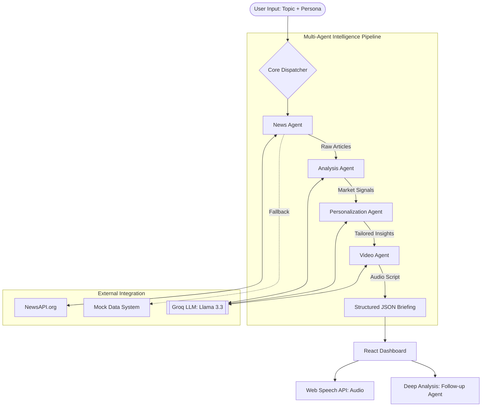

# 🏗️ Multi-Agent System Architecture

## 1. Overview
The **AI News Intelligence Dashboard** is not just a simple news aggregator; it is a structured **multi-agent AI system** designed to transform raw, noisy data into personalized, actionable intelligence. 

By simulating a pipeline of 4 specialized AI agents working sequentially, the system mimics an autonomous research department, moving from data collection to high-level strategic analysis.

### The 4-Agent Pipeline:
1.  **News Agent**: Data harvesting and cleaning.
2.  **Analysis Agent**: Trend identification and signal extraction.
3.  **Personalization Agent**: Contextual adaptation based on user expertise.
4.  **Video Agent**: Narration and delivery automation.

---

## 2. System Architecture

### Architectural Principles:
*   **Sequential Reasoning**: Each agent builds upon the structured output of the previous one, ensuring high-fidelity results.
*   **Graceful Degradation**: If live data sources fail, the News Agent autonomously switches to high-quality topic-specific mock data.
*   **Stateless Processing**: The core pipeline is stateless, while the frontend provides memory via `localStorage`.

---

## 3. Agent Responsibilities

#### 🧠 News Agent
*   **Primary Task**: Fetches real-time articles using NewsAPI.
*   **Resilience logic**: Sanitizes HTML content and handles rate-limiting.
*   **Recovery**: Automatically triggers a local "Mock Agent" if the API is unavailable or returns 0 results.

#### 📊 Analysis Agent
*   **Primary Task**: Acts as a senior market analyst.
*   **Focus**: Filters "noise" to find "signals." It identifies what has changed globally and why it matters to the specific industry.
*   **Deliverable**: Extracts key headlines and identifies 3-5 critical market movements.

#### 🎯 Personalization Agent
*   **Primary Task**: Adapts the analysis to the user's specific mental model.
*   **Logic**: 
    *   **Beginner**: Simplifies terminology, focuses on "What is this?" and explains general impacts.
    *   **Investor**: Uses financial nomenclature, focuses on "Alpha" and risk/reward implications.

#### 🎥 Video Agent
*   **Primary Task**: Acts as a scriptwriter for a "Daily News Briefing" segment.
*   **Output**: Generates a natural, engaging 4-6 line script used for the system's text-to-speech engine.

---

## 4. Data Flow

1.  **Ingestion**: User enters a topic (e.g., "NVIDIA Earnings") and selects a user type.
2.  **Harvesting**: The News Agent pulls the 5 most recent relevant articles.
3.  **Synthesis**: Articles are piped into the Analysis Agent to find the "Story behind the story."
4.  **Adaptation**: The Personalization Agent rewrites the findings for the target audience.
5.  **Narration**: The Video Agent creates the script, and the dashboard renders the final interactive briefing.

---

## 5. Key Features
*   **Multi-agent Simulation**: Demonstrates complex autonomous reasoning workflows.
*   **Hybrid Data Handling**: Seamlessly blends real-time API data with robust fallback mechanisms.
*   **Deep Dive Interaction**: The "Explain Deeper" feature allows users to query specific sections for secondary analysis.
*   **Audio-lite Interaction**: Uses the browser's native Web Speech API to provide an eyes-free briefing.
*   **Client-side Memory**: Persists previous searches for user convenience without requiring a heavy database.

---

## 6. Tech Stack
*   **Framework**: Next.js (App Router/TypeScript)
*   **LLM Provider**: Groq (Llama-3.3-70b-versatile) - Ultra-low latency inference.
*   **Data Source**: NewsAPI.org
*   **Voice**: Web Speech API (Native browser implementation)
*   **Styling**: Tailwind CSS / Radix UI / shadcn-ui

---

## 7. Why This Is Unique
Unlike standard "Chat with News" bots, this project represents a **structured end-to-end pipeline**. It simulates an autonomous system where agents coordinate their specialized skills to deliver a final product (The Briefing). It demonstrates how LLMs can be used not just for conversation, but as **logical controllers** in a complex data processing system.
